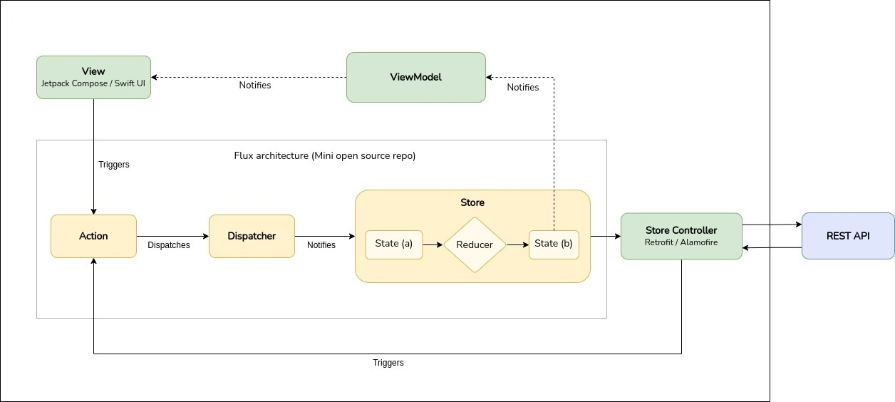

# FanSyn
Fancy audio player for Synology DiskStation NAS content. This application arises from the need to find a better user experience and user interface compared to the commercial app provided by Synology: DSAudio.
I hope it will be useful for many users!

#### 🚧 Work in progress 🚧

## Tech-stack
- [100% Kotlin](https://kotlinlang.org/) + [Coroutines](https://kotlinlang.org/docs/reference/coroutines-overview.html) + [Flow](https://kotlinlang.org/docs/flow.html)
- [Jetpack](https://developer.android.com/jetpack/)
    - [Lifecycle](https://developer.android.com/topic/libraries/architecture/lifecycle)
    - [ViewModel](https://developer.android.com/topic/libraries/architecture/viewmodel)
    - [Jetpack Compose](https://developer.android.com/jetpack/compose)
- [Retrofit](https://square.github.io/retrofit/) and [OkHttp](https://github.com/square/okhttp) for networking layer
- [Kodein](https://github.com/Kodein-Framework/Kodein-DI) for dependency injection

### Utils
- [Detekt](https://github.com/arturbosch/detekt): Code smell analysis for Kotlin projects
- [Timber](https://github.com/JakeWharton/timber): Custom logger on top of Android's normal Log class

## Architecture

The architecture used in this project is a minimal expression of the [Flux](https://facebook.github.io/flux/) architecture. Specifically, the implementation of the [Mini](https://github.com/hyperdevs-team/mini-kotlin) open source repo is used. The following image briefly shows the components that make up the application architecture and how they communicate with the Mini components. You can read more about this architecture in its [repository documentation](https://github.com/hyperdevs-team/mini-kotlin).



## Third party dependencies

### Synology API

[Synology Inc.](https://www.synology.com/) is a Taiwanese corporation that specializes in network-attached storage (NAS) appliances. 
This application needs to ask for the [Synology API](https://global.download.synology.com/download/Document/Software/DeveloperGuide/Package/FileStation/All/enu/Synology_File_Station_API_Guide.pdf) to login in platform, get the list of songs, stream the audio content, etc. Synology provides a [developer center](https://www.synology.com/support/developer#tool) with API documentation and tools to facilitate the development of modules within the ecosystem.

## Usage

In order to build and test the application, while the application is being developed, it is needed to specify two values in a settings.properties files:

- Your Synology NAS DiskStation URL:
```
synologyApiBaseUrl=<YOUR_SYNOLOGY_DISKSTATION_URL>
```
You can use both the [LAN IP](https://kb.synology.com/en-af/DSM/help/DSM/AdminCenter/connection_network_lan?version=7) or the [QuickConnect URL](https://kb.synology.com/en-af/DSM/help/DSM/Tutorial/cloud_set_up_quickconnect?version=6).


- The SID obtained in the login request response:
```
synologyLoginApiSid=<YOUR_SYNOLOGY_LOGIN_SID>
```
You can retrieve it in the response of the login request using the [Synology NAS API](https://global.download.synology.com/download/Document/Software/DeveloperGuide/Package/FileStation/All/enu/Synology_File_Station_API_Guide.pdf) and adding your account name and password:
```
<YOUR_SYNOLOGY_DISKSTATION_URL>webapi/auth.cgi?api=SYNO.API.Auth&version=3&method=login&account=<YOUR_ACCOUNT>&passwd=<YOUR_PASSWORD>&format=cookie
```